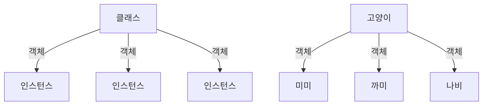
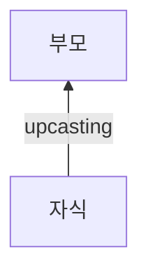
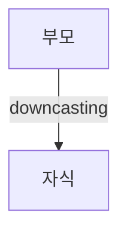

### 클래스, 객체, 인스턴스



위 다이어그램을 보면 알 수 있듯이, 클래스로부터 만들어진 객체를 인스턴스라 한다.

### 형 변환(type casting)

상속 관계가 있는 클래스들끼리만 타입 캐스팅이 가능하다.

#### as로 upcasting



`자식인스턴스 as 부모클래스`를 이용해 자식 인스턴스를 부모 클래스의 객체로 변환한다.

자식 인스턴스(부모로부터 상속받아 더 많은 것을 가지고 있다.)를 부모 클래스로 캐스팅(업캐스팅)하는 것은 성공할 것이기 때문에 보장된 변환(guaranteed conversion)이다.

```swift
let myButton : UIButton = UIButton()
let myControl = myButton as UIControl
// UIButton은 UIControl의 자식 클래스이므로 안전하게 형 변환이 된다.
```

<Toggle open summary="[클릭] UIButton과 UIButton의 자세한 계층뷰">


더 자세한 계층뷰 : [https://www.xmind.net/m/9TFEaz/#](https://www.xmind.net/m/9TFEaz/#)

</Toggle>

#### as! as?로 downcasting



`부모인스턴스 as! 자식클래스`나 `부모인스턴스 as? 자식클래스`를 이용해 부모 인스턴스를 자식 클래스로 변환한다.

성공 확신이 있다면 변환 실패시 crash가 나는 `as!`를 사용하여 강제 변환(forced conversion)을 하면 된다.

성공 확신이 없을 경우 변환 실패시 nil을 리턴하는 `as?`를 사용하여 안전하게 변환하면 된다.

즉, `as!`는 일반 타입으로 반환되고 `as?`는 옵셔널 타입으로 반환된다.

### 타입 검사 is

지정된 객체가 해당 클래스의 인스턴스인지 검사하는 키워드이다.

```swift
class Man { }
var chulsu : Man = Man()
if chulsu is Man {
    // chulsu가 Man의 인스턴스일 때 실행된다.
}
```

위와 같이 `인스턴스 is 클래스` 형식으로 사용하면 된다.

<Callout type="info">

이 게시물은 [Smile Han님의 유튜브](https://www.youtube.com/channel/UCM8wseo6DkA-D7yGlCrcrwA)를 참고하였습니다.

</Callout>
